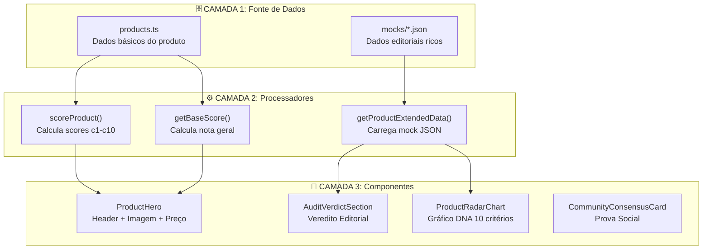
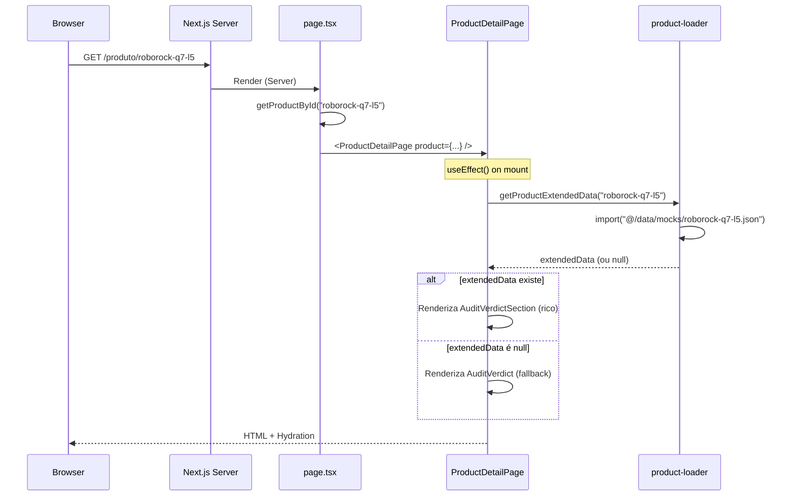

# Raio-X Completo: Arquitetura da Página de Produto (PDP)

> Documento técnico detalhando de onde vem cada campo, cada texto, e por que dados podem se perder durante o cadastro de produtos.

---

## 📊 Visão Geral da Arquitetura



---

## 📁 CAMADA 1: Fontes de Dados

### 1.1 `src/data/products.ts` - Dados Básicos

| Campo | Tipo | Exemplo | Obrigatório | Quem Preenche |
|-------|------|---------|-------------|---------------|
| `id` | string | `"roborock-q7-l5"` | ✅ | Scaffolder |
| `name` | string | `"Roborock Q7 L5..."` | ✅ | Scaffolder |
| `shortName` | string | `"Roborock Q7 L5"` | ✅ | Scaffolder |
| `brand` | string | `"Roborock"` | ✅ | Scaffolder |
| `categoryId` | string | `"robot-vacuum"` | ✅ | Scaffolder |
| `price` | number | `2106` | ✅ | Manual/Scraper |
| `imageUrl` | string | `/images/...` | ✅ | Manual |
| `gallery` | string[] | `["/img1.webp"]` | ⚠️ | Manual |
| `benefitSubtitle` | string | `"LiDAR preciso..."` | ⚠️ | **MANUAL** |
| `scores` | object | `{c1: 9.5, c2: 9.0}` | ✅ | Scaffolder |
| `scoreReasons` | object | `{c1: "PREMIUM..."}` | ⚠️ | **MANUAL** |
| `specs` | object | specs técnicas | ✅ | Scaffolder |
| `attributes` | object | atributos extras | ⚠️ | Scaffolder |
| `offers` | array | links afiliados | ⚠️ | **MANUAL** |
| `featureBenefits` | array | benefícios | ⚠️ | **MANUAL** |
| `badges` | string[] | `["premium"]` | ⚠️ | **MANUAL** |

#### ⚠️ CAMPOS QUE FREQUENTEMENTE SE PERDEM:

```typescript
// Estes campos NÃO são gerados automaticamente pelo scaffolder!
// Você precisa preencher manualmente:

benefitSubtitle: 'TODO: headline editorial',  // ❌ Precisa preencher
scoreReasons: {                                // ❌ Precisa preencher
    c1: 'TODO: explicar nota c1',
    c2: 'TODO: explicar nota c2',
    // ...
},
offers: [],                                    // ❌ Precisa adicionar links
featureBenefits: [],                           // ❌ Precisa adicionar
gallery: [],                                   // ❌ Precisa adicionar
```

---

### 1.2 `src/data/mocks/<product-id>.json` - Dados Editoriais Ricos

Este arquivo contém TODO o conteúdo editorial da página. **Se não existir, a página usa fallbacks genéricos.**

```json
{
  "product": { /* identificação básica */ },
  
  "header": {
    "overallScore": 8.36,           // ← Usado no badge de nota
    "scoreLabel": "Muito Bom",      // ← Label textual
    "title": "Roborock Q7 L5",      // ← Título exibido
    "subtitle": "LiDAR preciso...", // ← 🏆 HEADLINE PRINCIPAL
    "badges": [...]                 // ← Badges no header
  },
  
  "auditVerdict": {
    "solution": {
      "title": "A Solução",
      "items": [                     // ← Lista de pontos positivos
        "Navegação LiDAR...",
        "8000Pa de sucção..."
      ]
    },
    "attentionPoint": {
      "items": [...]                 // ← Pontos de atenção
    },
    "technicalConclusion": {
      "text": "O Q7 L5 entrega..."   // ← Conclusão editorial
    },
    "dontBuyIf": {
      "items": [...]                 // ← "Não compre se..."
    }
  },
  
  "productDna": {
    "dimensions": [                  // ← Dados do radar chart
      {
        "id": "c1",
        "name": "Navegação & Mapeamento",
        "score": 9.5,
        "description": "PREMIUM: LiDAR..."  // ← Tooltip do radar
      }
    ]
  },
  
  "simulators": { ... },             // ← Alertas de simulação
  
  "decisionFAQ": [                   // ← FAQ editorial
    {
      "question": "Q7 L5 vs Q7 Max?",
      "answer": "Resumo prático..."
    }
  ]
}
```

---

## ⚙️ CAMADA 2: Processadores

### 2.1 `getProductExtendedData(productId)`

**Arquivo:** `src/lib/product-loader.ts`

**O que faz:** Busca o arquivo `src/data/mocks/<productId>.json`

```typescript
// Fluxo:
1. Recebe productId (ex: "roborock-q7-l5")
2. Tenta carregar: src/data/mocks/roborock-q7-l5.json
3. Se existir: retorna dados ricos (auditVerdict, productDna, etc.)
4. Se NÃO existir: retorna null → componentes usam FALLBACK
```

**⚠️ PROBLEMA COMUM:** Se o mock JSON não existe, a página usa dados genéricos!

---

### 2.2 `scoreProduct(product)` e `getBaseScore(product)`

**Arquivo:** `src/lib/scoring.ts` e `src/lib/getBaseScore.ts`

**O que faz:** Calcula a nota geral a partir dos scores c1-c10

```typescript
// Fórmula (simplificada):
const weights = { c1: 0.25, c2: 0.15, c3: 0.15, ... };
const overallScore = Σ(scores[cN] * weights[cN]);

// Se product.scores não existe ou está incompleto:
// → Usa defaults (7.0) → Nota genérica → Página pobre
```

---

## 🎨 CAMADA 3: Componentes UI

### 3.1 `ProductHero` - Hero Section

| Elemento Visual | De Onde Vem | Fallback |
|-----------------|-------------|----------|
| 🏆 Headline azul | `extendedData.header.subtitle` → `product.benefitSubtitle` | "Melhor Opção da Categoria" |
| Título h1 | `product.name` | - |
| Badge de nota | `getBaseScore(product)` | 7.00 |
| Lista de checkmarks | `product.featureBenefits[0..2].title` | "Marca Confiável" |
| Galeria de imagens | `product.gallery` → `product.imageUrl` | Placeholder |
| Card azul (insight) | `CuriositySandwich` gerado localmente | Baseado em score/preço |

---

### 3.2 `AuditVerdictSection` vs `AuditVerdict`

**Decisão no código:**
```tsx
{extendedData?.auditVerdict ? (
    <AuditVerdictSection data={extendedData.auditVerdict} />  // ✅ RICO
) : (
    <AuditVerdict solution={...} attention={...} />           // ⚠️ FALLBACK
)}
```

| Componente | Quando Usado | Qualidade |
|------------|--------------|-----------|
| `AuditVerdictSection` | Mock JSON existe | ✅ Rico, editorial |
| `AuditVerdict` | Mock JSON NÃO existe | ⚠️ Genérico, calculado |

---

### 3.3 `ProductRadarChart` - Gráfico DNA

| Campo | De Onde Vem | Fallback |
|-------|-------------|----------|
| Scores (c1-c10) | `product.scores` | 7.0 para todos |
| Tooltips/Reasons | `product.scoreReasons` → `extendedData.productDna.dimensions[].description` | Texto genérico |
| Labels dos eixos | Hardcoded por categoria em `ProductDetailPage.tsx` | - |

---

### 3.4 `CommunityConsensusCard` - Prova Social

| Campo | De Onde Vem | Fallback |
|-------|-------------|----------|
| % Aprovação | Calculado: `85 + (score - 7) * 5` | ~85% |
| Total Reviews | `product.price > 5000 ? "2.5k+" : "5k+"` | Estimativa |
| Flaw Aceitável | Hardcoded por categoria/marca | Genérico |
| Golden Tip | Hardcoded por categoria | Genérico |

---

## 🔴 ONDE OS DADOS SE PERDEM (Diagnóstico)

### Problema 1: Scaffolder Gera TODOs

```typescript
// scaffold-product.ts gera:
header: {
    subtitle: `TODO: Preencher subtitle editorial para ${product.brand}`,
}
```

**Sintoma:** Headline mostra "TODO: Preencher..."  
**Solução:** Preencher `benefitSubtitle` no `products.ts`

---

### Problema 2: Mock JSON Não Existe

```
src/data/mocks/
├── roborock-q7-l5.json    ✅ Existe → Página rica
├── wap-w400.json          ✅ Existe → Página rica
└── novo-produto.json      ❌ NÃO EXISTE → Fallback genérico
```

**Sintoma:** Seções como "A Solução" mostram texto genérico  
**Solução:** Criar mock JSON com conteúdo editorial

---

### Problema 3: `offers` Não Preenchido

```typescript
// products.ts
offers: [],  // ❌ Array vazio
```

**Sintoma:** Botões "Ver na Amazon" não mostram preço correto  
**Solução:** Adicionar offers com links de afiliado

---

### Problema 4: `scoreReasons` Não Preenchido

```typescript
// products.ts
scoreReasons: undefined,  // ❌ Não existe
```

**Sintoma:** Radar chart não mostra tooltips explicativos  
**Solução:** Preencher scoreReasons para c1-c10

---

### Problema 5: `featureBenefits` Não Preenchido

```typescript
// products.ts
featureBenefits: [],  // ❌ Array vazio
```

**Sintoma:** Lista de checkmarks mostra "Marca Confiável" genérico  
**Solução:** Adicionar 3-5 feature benefits específicos

---

## 📋 CHECKLIST DE CADASTRO COMPLETO

Para cada novo produto, verificar:

### Em `products.ts`:
- [ ] `id` único no formato `marca-modelo`
- [ ] `name` completo com marca e modelo
- [ ] `shortName` versão curta
- [ ] `brand` correto
- [ ] `categoryId` válido
- [ ] `price` atualizado
- [ ] `imageUrl` apontando para imagem existente
- [ ] `gallery` com 3-5 imagens
- [ ] `benefitSubtitle` ← **CRÍTICO: headline editorial**
- [ ] `scores` c1-c10 preenchidos corretamente
- [ ] `scoreReasons` explicando cada nota
- [ ] `offers` com links de afiliado
- [ ] `featureBenefits` com 3-5 benefícios

### Em `src/data/mocks/<id>.json`:
- [ ] Arquivo existe
- [ ] `header.subtitle` preenchido
- [ ] `auditVerdict.solution.items` com 4-5 pontos
- [ ] `auditVerdict.attentionPoint.items` com 3-4 pontos
- [ ] `auditVerdict.technicalConclusion.text` editorial
- [ ] `auditVerdict.dontBuyIf.items` com 3-4 razões
- [ ] `productDna.dimensions` com descriptions
- [ ] `decisionFAQ` com 3-4 perguntas

---

## 🛠️ TECNOLOGIAS USADAS

| Tecnologia | Onde | Por quê |
|------------|------|---------|
| **Next.js 14 App Router** | Roteamento | SSR/SSG para SEO |
| **TypeScript** | Todo código | Type safety |
| **React Server Components** | `page.tsx` | Dados no servidor |
| **Client Components** | `ProductDetailPage.tsx` | Interatividade |
| **JSON estático** | `products.ts`, `mocks/*.json` | Sem latência de API |
| **Tailwind CSS** | Estilos | Consistência visual |
| **Lucide Icons** | Ícones | Bundle leve |

---

## 📁 MAPA DE ARQUIVOS

```
src/
├── app/produto/[slug]/
│   └── page.tsx                    # Server Component - carrega produto
│
├── components/
│   └── ProductDetailPage.tsx       # Client Component - renderiza tudo
│       ├── ProductHero             # Hero section
│       ├── CuriositySandwich       # Card azul insight
│       ├── CostBenefitChart        # Barra de custo-benefício
│       ├── AuditVerdict            # Fallback genérico
│       └── ...
│
├── components/pdp/
│   ├── AuditVerdictSection.tsx     # Componente rico do mock JSON
│   ├── SimulatorsSection.tsx       # Alertas de simulação
│   └── ModuleFallback.tsx          # Fallback visual
│
├── data/
│   ├── products.ts                 # TODOS os produtos
│   └── mocks/
│       ├── roborock-q7-l5.json     # Dados editoriais
│       └── ...
│
├── lib/
│   ├── product-loader.ts           # getProductExtendedData()
│   ├── scoring.ts                  # scoreProduct()
│   ├── getBaseScore.ts             # getBaseScore()
│   └── category-prices.ts          # getCategoryPriceStats()
│
└── config/
    └── product-json-schema.ts      # TypeScript types
```

---

## 🔄 FLUXO DE RENDERIZAÇÃO



---

## 💡 RECOMENDAÇÕES

1. **Sempre crie o mock JSON** antes de considerar o produto "cadastrado"
2. **Use o roborock-q7-l5.json como template** - copie e adapte
3. **Preencha `benefitSubtitle`** - é o texto mais visível da página
4. **Preencha `scoreReasons`** - melhora tooltips do radar
5. **Adicione `offers`** - garante links de afiliado corretos
6. **Valide com `validate:pdp-content`** antes de commit

---

*Documento gerado em 2026-01-26. Arquitetura sem chamadas de API externas.*
